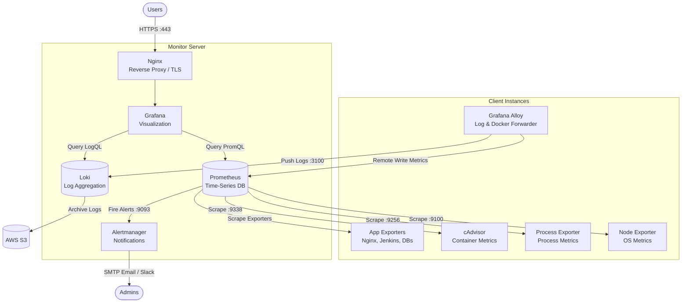

# Observability Stack

> A complete, production-ready client-server monitoring solution powered by Prometheus, Grafana, Loki, and Alertmanager.

## 📖 Overview

This repository provides a fully Dockerized, pre-configured observability stack for monitoring distributed infrastructure. It enforces a robust **Client-Server architecture** where lightweight agents on client nodes collect telemetry (metrics and logs) and securely transmit them to a central monitoring server for aggregation, visualization, and alerting.

## ✨ Features

- **Holistic Monitoring:** Collect hardware, OS, and process-level metrics seamlessly across all nodes.
- **Centralized Log Management:** Unify application, system, and container logs directly into Loki via Grafana Alloy.
- **Dynamic Service Discovery:** Automatically discover and scrape AWS EC2 instances utilizing resource tags, or securely add on-premise nodes via centralized scripts.
- **Deep Container Insights:** Leverage active monitoring of Docker daemons and containers inside the stack via cAdvisor.
- **Extensible App Exporters:** Included out-of-the-box support for Nginx, Jenkins, PostgreSQL, MySQL, Redis, and MongoDB metrics.
- **Scalable Log Storage:** Native support for securely archiving and retaining Loki logs on AWS S3 buckets.
- **Intelligent Alerting:** Ready-to-use Alertmanager integration with dynamic email routing for critical thresholds (e.g., High CPU, High Memory).
- **Curated Dashboards:** Pre-populated with an extensive suite of highly-detailed, battle-tested Grafana dashboards for immediate insight.

## 🏗️ Technical Architecture

## 🛠️ Tools & Technologies Used

- **[Prometheus](https://prometheus.io/)**: Open-source systems monitoring and alerting toolkit serving as the metrics backend.
- **[Grafana](https://grafana.com/)**: Multi-platform open-source analytics and interactive visualization web application.
- **[Loki](https://grafana.com/oss/loki/)**: Horizontally-scalable, highly-available, multi-tenant log aggregation system tailored to work wonderfully with Prometheus.
- **[Alertmanager](https://prometheus.io/docs/alerting/latest/alertmanager/)**: Routes and de-duplicates alerts generated by Prometheus.
- **[Grafana Alloy](https://grafana.com/oss/alloy/)**: Flexible, high-performance telemetry collector (replacing Promtail) used here to capture logs and Docker metrics.
- **[Docker Compose](https://docs.docker.com/compose/)**: Underpins the deployment structure for isolated, reproducible environments.

## 📚 Documentation Guides

Detailed, step-by-step documentation is provided in the `docs/` directory. **Start here for your deployment.**

1. **[Server Setup Guide](docs/server-guide.md)**: Instructions for deploying the central Monitor server.
2. **[Client Setup Guide](docs/client-guide.md)**: Instructions for deploying telemetry agents on your application, web, or database nodes.
3. **[AWS Integration Guide](docs/aws-guide.md)**: Setup advanced cloud features, including storing Loki logs in S3 and utilizing EC2 tags for automatic Service Discovery.
4. **[Nginx Monitoring Guide](docs/setup-nginx.md)**: Concrete steps for exposing detailed Nginx metrics directly to the stack.

## 🚀 Quick Access Points

Once deployed, the following services and health-check endpoints will be available. Adjust `localhost` to your server's public IP or Domain as necessary.

| Service | Address | Default Credentials |
|---------|---------------|-------------|
| **Grafana** Web UI | `http://localhost:3000` | `admin` / configurable in `.env` |
| **Prometheus** Web UI | `http://localhost:9090` | - |
| **Prometheus** Targets | `http://localhost:9090/targets` | - |
| **Loki** Ready Check | `http://localhost:3100/ready` | - |
| **Alertmanager** Web UI | `http://localhost:9093` | - |
| **Alloy UI** (On Client Node)| `http://<client-ip>:12345` | - |

## 📊 Pre-Loaded Dashboard Library

This stack is provisioned immediately upon startup with multiple essential Grafana dashboards. You won't need to build from scratch.

- **Full Node Monitoring**: Node Exporter (ID: `1860`)
- **Docker Environment**: cAdvisor OS Insights (ID: `16314`, `19908`, `19724`, `11600`)
- **Web Infrastructure**: Nginx Dashboard (ID: `12708`)
- **CI/CD Build Server**: Jenkins Performance and Health (ID: `9964`)
- **Event Auditing**: Global SSH Logs (ID: `17514`, `21750`)
- **Application Logs**: General Log Inspector (ID: `13639`)
- **Database Tracking**: MongoDB (ID: `2583`)

---
*Developed and maintained for reliable infrastructure observability.*
