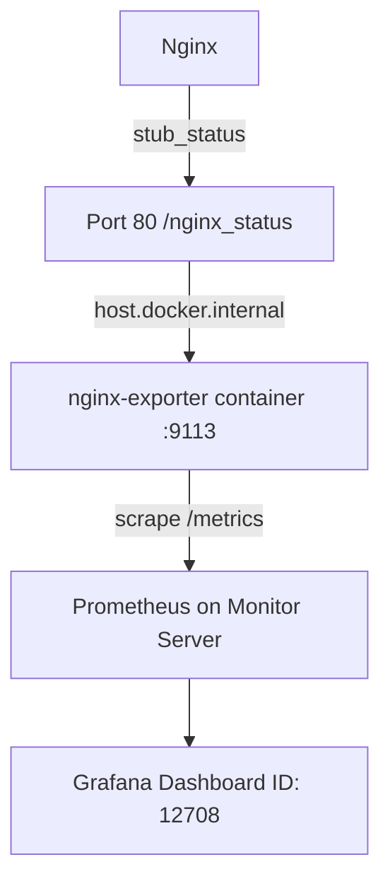

# Nginx Monitoring Setup Guide

This guide covers adding Nginx metrics to the observability stack using the official `nginx-prometheus-exporter` container.

---

## 1. Overview and Architecture

The core requirement is establishing a bridge between the Nginx instance running on your host OS and the Prometheus container running inside the Docker network.



The exporter **bridges** between Nginx (host OS) and Prometheus (Docker network). The key is `host.docker.internal` — without it, the container cannot reach the host's Nginx.

---

## 2. Step-by-Step Setup

### Step 2.1 — Enable Nginx stub_status

Add the `/nginx_status` location block **inside** your existing `server {}` block.

**Preferred Method: Dedicated config file**
```bash
sudo tee /etc/nginx/conf.d/stub_status.conf << 'EOF'
server {
    listen 80;
    server_name 127.0.0.1 localhost;

    location /nginx_status {
        stub_status on;
        allow 127.0.0.1;
        deny all;
    }
}
EOF
```

> [!WARNING]  
> If port 80 is already used by an existing site with `server_name _;`, there will be a conflict. Use a unique port like `9145` in that case (see [Port Conflict section](#if-port-80-is-taken) below).

### Step 2.2 — Test and Reload Nginx
```bash
sudo nginx -t
sudo systemctl reload nginx
```

Verify it responds locally:
```bash
curl http://localhost:80/nginx_status
```

Expected output:
```text
Active connections: 2 
server accepts handled requests
 100 100 250 
Reading: 0 Writing: 1 Waiting: 1
```

### Step 2.3 — Configure the Client `.env`

In `~/observability/client/.env`, set these variables to enable the nginx exporter Compose profile.

```env
# Enable the nginx exporter profile
COMPOSE_PROFILES=nginx

# Point to the Nginx stub_status endpoint (accessible from inside Docker)
NGINX_STATUS_URL=http://host.docker.internal:80/nginx_status
```

> **Note**: `host.docker.internal` resolves to the host machine's IP from inside Docker containers.

### Step 2.4 — Start the Nginx Exporter

```bash
cd ~/observability/client
docker compose --profile nginx up -d
```

Verify the exporter is translating the metrics:
```bash
curl http://localhost:9113/metrics | grep "^nginx"
```

You should see:
```text
nginx_connections_accepted 100
nginx_connections_active 1
nginx_connections_handled 100
nginx_connections_reading 0
nginx_connections_waiting 0
nginx_connections_writing 1
nginx_http_requests_total 250
nginx_up 1
```

> **Success Check:** `nginx_up 1` indicates success. If `nginx_up 0`, the exporter cannot reach stub_status. Re-check Step 2.1 and 2.3.

### Step 2.5 — Add Node to Prometheus on the Monitor Server

On your **centra Monitor server**, run the helper script to begin scraping this new node's Nginx exporter port (9113).

```bash
cd ~/observability/server
./scripts/add-node.sh <NODE_IP> <HOSTNAME> production --nginx
```

Alternatively, manually edit `prometheus/targets/clients.json` to add port `9113` to the targets list.

### Step 2.6 — Import Grafana Dashboard

In Grafana: **Dashboards → Import → ID: `12708`**  
Select `Prometheus` as the data source and import.

The `instance` dropdown in the dashboard will automatically populate with `<NODE_IP>` once Prometheus begins scraping.

---

## 3. Troubleshooting

### If Port 80 is Taken
*Issue: A node running Jenkins on 8080, with a full website already bound to port 80 (meaning no room for stub_status).*

**Fix:** Use a dedicated high port like `9145`.
```bash
sudo tee /etc/nginx/conf.d/stub_status.conf << 'EOF'
server {
    listen 9145;
    location /nginx_status {
        stub_status on;
    }
}
EOF

sudo nginx -t && sudo systemctl reload nginx
curl http://localhost:9145/nginx_status
```

Then, update your `.env`:
```env
NGINX_STATUS_URL=http://host.docker.internal:9145/nginx_status
```

> [!IMPORTANT]  
> Make sure port `9145` is **not** blocked by a firewall rule for external access (only the Docker container needs to reach it via the host gateway, not the internet).

### Check `nginx_up 0` Root Causes
When we previously set up Nginx monitoring, three separate issues caused `nginx_up 0`. Ensure you haven't run into one of them:

| # | Issue | Root Cause | Fix |
|---|-------|-----------|-----|
| 1 | `nginx_up 0` — stub_status not found | The `location /nginx_status` block was placed **outside** a `server {}` block in `sites-available/default` | Embed it inside the correct `server {}` block OR create a dedicated `conf.d` file |
| 2 | Container can't reach host Nginx | `nginx-exporter` Docker container had no `extra_hosts` — `host.docker.internal` didn't resolve | Added `extra_hosts: host.docker.internal:host-gateway` to `docker-compose.yml` *(this is already fixed in the repo!)* |
| 3 | Port conflict | Tried to bind stub_status on port `8080`, but Jenkins was already using it | Used a different port (`9145`). For new nodes without Jenkins, port `80` is preferred |

---

## 4. Quick Verification Checklist

```bash
# 1. stub_status is responding
curl http://localhost:80/nginx_status          # or :9145 if using alt port

# 2. nginx-exporter is scraping it
curl http://localhost:9113/metrics | grep nginx_up   # must be 1

# 3. Prometheus can reach the exporter
curl http://<monitor-ip>:9090/api/v1/query?query=nginx_up
# Response should include "value": ["1"]

# 4. Grafana dashboard 12708 shows data
# - Open http://<monitor-ip>:3000
# - Import dashboard ID: 12708
# - Select instance = <NODE_IP> from dropdown
```
